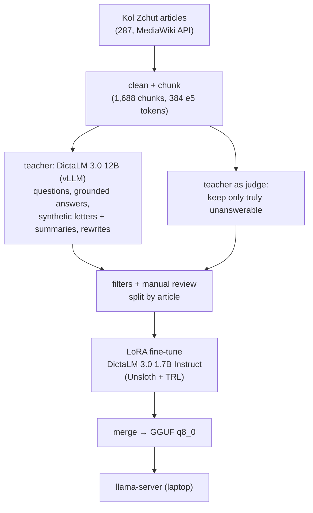
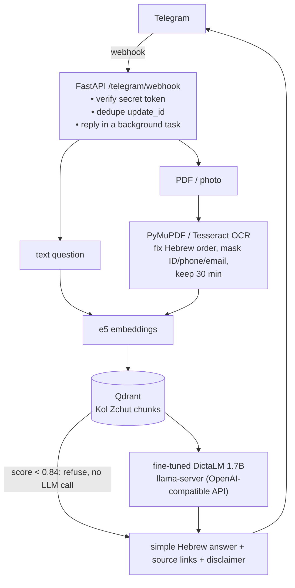

# Bureaucracy Navigator — עוזר מסמכים ובירוקרטיה

A Telegram bot that explains Israeli bureaucracy in simple Hebrew, powered by a **small Hebrew LLM fine-tuned for this exact job**. Users can:

- **Ask a question** ("איך מגישים תביעה לדמי אבטלה?") and get a short, simple answer with links to the [Kol Zchut](https://www.kolzchut.org.il) articles it used.
- **Send a PDF or a photo of an official letter** (Bituah Leumi, the tax authority, an employer, a landlord, the municipality) and get a plain-Hebrew summary: what the letter says, what to do, by when, and whom to contact. Personal details are masked first.

The model is **DictaLM 3.0 1.7B Instruct**, fine-tuned with LoRA on 1,128 task-specific examples generated by a 12B teacher from Kol Zchut, exported to GGUF and served **locally on a laptop** with llama-server.

🎥 **Demo:** _video link — Task 3.14_ · 🤗 **Adapters:** [AhmadTawil1/dictalm3-bureaucracy-lora](https://huggingface.co/AhmadTawil1/dictalm3-bureaucracy-lora)

## What fine-tuning changed

Same 232 held-out test examples (articles never seen in training), same retrieved chunks for every model:

| | Base 1.7B | **Fine-tuned 1.7B** | Teacher 12B |
|---|---|---|---|
| Refuses when the sources don't answer | 0% | **61%** | 0% |
| Letter summary in the required 4-heading format | 28% | **100%** | 100% |
| Plain text (Telegram shows no markdown) | 49% | **100%** | 84% |
| Correct answers (manual, 30 questions) | 8/30 | **16/30** | — |
| Every claim grounded in the sources (manual) | 15/30 | **26/30** | — |
| Seconds per answer (laptop CPU) | 51.1 | **32.6** | — |

The base model answers everything (even when its sources don't contain the answer), dumps markdown, and sometimes loops. The fine-tuned model is shorter, grounded, cites its sources, follows the letter format, and says "לא מצאתי מידע אמין על זה במקורות שלי" when it should. Its main weakness is the other side of that trade-off: it also refuses **12%** of questions it could have answered.

## Architecture

**Training pipeline (Colab, L4 GPU)**



**Serving pipeline (laptop)**



The prompts (`app/prompts.py`) are shared by data generation and the bot, so the model sees at serving time exactly the format it was trained on.

## Dataset

**Source.** 287 practical articles (types `right`, `proceeding`, `service`, `guide`; court rulings, portals and glossary pages excluded) from four Kol Zchut categories: אבטלה, הבטחת הכנסה, מס הכנסה, פיטורים. Cleaned from HTML (navigation, edit links, contact tables removed) and packed into 1,688 chunks of up to 384 e5 tokens, each keeping its `## section` headings.

**Four tasks**, generated with `dicta-il/DictaLM-3.0-Nemotron-12B-Instruct-W4A16` on vLLM:

| Task | Input → target | Generated | Kept |
|---|---|---|---|
| Grounded QA | question + 4 retrieved chunks (shuffled) → simple answer citing `[n]` | 850 | 798 |
| Unanswerable | question + 4 look-alike chunks from *other* articles → fixed refusal | 148 | 148 |
| Letter summary | synthetic official letter (fake details) + 3 chunks → 4 headings | 378 | 285 |
| Plain-Hebrew rewrite | long bureaucratic paragraph → short sentences | 400 | 397 |

**Quality steps** (each one came from reading the generated data):
- Questions: 3 per chunk from the teacher, then 1,000 sampled round-robin across articles.
- Unanswerable: the naive version (chunks from another article) often *did* contain the answer, because Kol Zchut articles overlap. The teacher now judges every candidate; only 148 of 1,500 passed.
- QA answers and rewrites generated at **temperature 0.2**: at 0.7, a manual review found wrong or made-up facts in about a third of the answers.
- Filters: valid citations only, QA must cite, refusal text exact, all 4 letter headings, the letter's deadline in its summary, ≤ 250 words, ≥ 70% Hebrew, no placeholders or links, no copied FAQ lists or first-person answers, near-duplicate questions removed; markdown stripped.
- **Split by article**: 40 of 269 articles (15%) are test-only. Train/val examples whose *context* shows a test-article chunk are dropped too, so no test text is seen in training. Result: **train 1,128 · val 125 · test 232**.

**License.** Kol Zchut content is [CC BY-NC-SA 2.5 IL](https://creativecommons.org/licenses/by-nc-sa/2.5/il/). This project is non-commercial, credits Kol Zchut, links sources in every answer, and shares all derived data (`data/out/`) under the same license.

## Training

| | |
|---|---|
| Base model | `dicta-il/DictaLM-3.0-1.7B-Instruct` (Apache-2.0) |
| Method | LoRA, 16-bit (not QLoRA): r=16, alpha=32, dropout 0, all attention + MLP projections |
| Loss | assistant answers only (`train_on_responses_only`) |
| Schedule | 2 epochs (142 steps), effective batch 16, lr 2e-4 cosine, warmup 5%, max length 4,096 |
| Hardware / time | Colab L4, ~20 minutes (Unsloth + TRL) |
| Loss | train 0.383; validation still falling at the end (best checkpoint = step 140 of 142, 0.391) |
| Export | merged → GGUF q8_0 (1.8 GB); the base model converted the same way for a fair comparison |

Notebook: [`training/finetune_dictalm.ipynb`](training/finetune_dictalm.ipynb).

## Results

### Automatic metrics (232 test examples, temperature 0)

| Metric | Base 1.7B | Fine-tuned 1.7B | Teacher 12B |
|---|---|---|---|
| Citation validity (QA) | 81% | 84% | 100% |
| Correct refusals (unanswerable, n=18) | 0% | 61% | 0% |
| Wrong refusals (answerable QA, n=116) | 0% | 12% | 0% |
| Letter: all 4 headings (n=40) | 28% | 100% | 100% |
| Letter: deadline match (n=9) | 100% | 100% | 100% |
| Plain text (no markdown) | 49% | 100% | 84% |
| Words per sentence | 10.2 | 11.2 | 11.8 |
| Seconds per answer (laptop CPU, 20 examples) | 51.1 | 32.6 | — |

Citation validity counts refusals as invalid; among the questions the fine-tuned model answers, about 95% have valid citations. The teacher never refuses: refusal is a behavior this project taught the student, not one it copied from the teacher. Code: [`eval/run.py`](eval/run.py).

### Manual scoring (30 test questions)

| | Correct | Partial | Wrong | Grounded |
|---|---|---|---|---|
| Base 1.7B | 8 | 18 | 4 | 15 |
| Fine-tuned 1.7B | **16** | 7 | 7 | **26** |

Rows were shuffled with the model hidden ([`eval/manual.py`](eval/manual.py)). **Note:** the scoring was done with an AI assistant (Claude), not a human expert, and the models can be told apart by style, so it is not fully blind. 4 of the fine-tuned model's 7 "wrong" answers are refusals of answerable questions.

### Letters end to end (5 synthetic letters × PDF and phone photo)

Run through the bot's own pipeline ([`eval/letters_e2e.py`](eval/letters_e2e.py)):

| Letter | Input | Words recovered | Right order | 4 headings | Deadline under "עד מתי" | ID masked |
|---|---|---|---|---|---|---|
| Bituah Leumi: missing documents | PDF | 100% | ✅ | ✅ | ✅ | ✅ |
| Bituah Leumi: missing documents | Photo | 99% | ✅ | ✅ | ✅ | ✅ |
| Tax authority: refund documents | PDF | 100% | ✅ | ✅ | ✅ | ✅ |
| Tax authority: refund documents | Photo | 92% | ✅ | ✅ | ✅ | ✅ |
| Employer: hearing before dismissal | PDF | 100% | ✅ | ✅ | ✅ | ✅ |
| Employer: hearing before dismissal | Photo | 95% | ✅ | ✅ | ❌ OCR misread the date | ✅ |
| Landlord: lease ending | PDF | 100% | ✅ | ✅ | ❌ gave the deposit terms | ✅ |
| Landlord: lease ending | Photo | 95% | ✅ | ✅ | ❌ gave the deposit terms | ✅ |
| Municipality: arnona debt | PDF | 100% | ✅ | ✅ | ✅ | ✅ |
| Municipality: arnona debt | Photo | 98% | ✅ | ✅ | ✅ | ✅ |

## Privacy

- Files are processed **in memory only**; nothing is written to disk.
- Israeli ID numbers (only those that pass the check digit), phone numbers and emails are masked **before** the text is stored or sent to the model.
- The masked letter is kept for 30 minutes for follow-up questions; `/forget` deletes it immediately. A restart forgets everything.
- Logs never contain message content, and the bot token is kept out of logs (Bot API URLs contain it).
- Messages pass through Telegram's servers.

## Limitations

- The training data was generated by a teacher model and can carry its mistakes; filters and a manual review reduced them but did not remove them.
- The fine-tuned model over-refuses: 12% of answerable test questions.
- For some questions it copies long procedure text from its sources instead of answering, without citations. The bot then lists the articles it was given, caps the answer at 450 tokens and cuts it at the last full line.
- Letter summaries sometimes put the wrong date under "עד מתי" (2 of 10 in the end-to-end test).
- Masking also hides the sender's contact phone numbers; it can't tell them from the recipient's.
- Covers only the ingested Kol Zchut topics (unemployment, income support, income tax, dismissal); the knowledge base must be refreshed to stay current.
- OCR quality depends on the photo; handwriting and complex tables are not supported.
- **General information, not legal advice.** Every answer links to its sources.

## How to run (Windows)

Requirements: Python 3.13 with [uv](https://docs.astral.sh/uv/), [Tesseract](https://github.com/UB-Mannheim/tesseract/wiki) with Hebrew (`heb`), `llama-server` (`winget install ggml.llamacpp`), `cloudflared` (`winget install Cloudflare.cloudflared`), a Telegram bot token from @BotFather.

```bash
uv sync
cp .env.example .env                    # fill TELEGRAM_BOT_TOKEN and TELEGRAM_WEBHOOK_SECRET

# knowledge base: download + clean + chunk; embeddings are computed on Colab (data/embed.py),
# then loaded into the local Qdrant:
uv run python data/ingest_kolzchut.py
uv run python -c "from data.ingest_kolzchut import store; store()"

# model: the fine-tuned GGUF (see Training) in models/
llama-server -m models/dictalm3-bureaucracy-q8_0.gguf --jinja -c 16384 --port 8080

uv run uvicorn app.main:app --port 8000
cloudflared tunnel --url http://localhost:8000   # copy the https URL into PUBLIC_URL in .env
uv run python -m scripts.set_webhook

uv run pytest -q                        # 19 tests
```

Data generation and training run on Colab: `data/generate.py` (one step per run, see its docstring), [`training/finetune_dictalm.ipynb`](training/finetune_dictalm.ipynb) and [`eval/eval_colab.ipynb`](eval/eval_colab.ipynb).

## Project layout

```
app/        the bot: webhook, routing, retrieval, LLM client, documents, privacy, sessions, shared prompts
data/       ingestion, teacher generation (Colab), filters + split; data/out/ = chunks and train/val/test
training/   Unsloth LoRA notebook (Colab)
eval/       automatic metrics, blind manual scoring, letters end to end, Colab eval notebook, results/
scripts/    set_webhook.py
tests/      pytest
```
